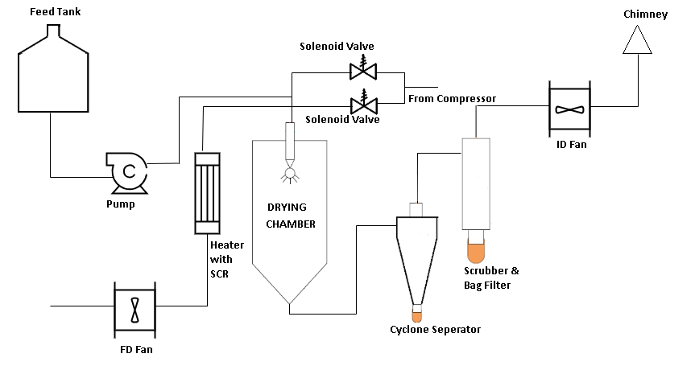

The theory covers basic aspects about the design and running of spray dryer pilot plant. 
A spray dryer pilot plant is a small-scale facility designed to test and optimize the spray drying process for various products, such as food,
pharmaceuticals, and chemicals. The pilot plant is a scaled-down version of a commercial spray dryer, allowing for the development and refinement 
of new products, processes, and formulations in a controlled and cost-effective environment.

#### Design Aspects:

Layout and Configuration: The pilot plant is typically designed as a compact, modular unit with a footprint of around 100-200 square feet. The layout
is optimized for ease of operation, maintenance, and cleaning.

#### Drying Chamber:

The heart of the pilot plant is the drying chamber, where the spray drying process takes place. The chamber is designed to accommodate various spray
dryer configurations, including co-current, counter-current and mixed flow arrangements.

#### Atomization System: 

The atomization system is responsible for breaking down the liquid feed into a spray of droplets. The pilot plant may feature different atomization 
technologies, such as two-fluid nozzles, rotary atomizers, or ultrasonic atomizers.

#### Heating and Cooling Systems:

The pilot plant is equipped with heating and cooling systems to control the temperature and humidity of the drying process. These systems may include
 heat exchangers, steam generators, and chillers.

#### Powder Collection and Handling: 

The pilot plant features a powder collection system, which may include cyclones, bag filters, or electrostatic precipitators. The collected powder
is then conveyed to a storage vessel or packaging system.

### Development Aspects:

#### Process Development:

The pilot plant is used to develop and optimize spray drying processes for new products or formulations. This involves testing different operating
conditions, feed rates, and atomization settings to achieve the desired product characteristics.

#### Scale-Up: 

The pilot plant serves as a stepping stone for scaling up the spray drying process to commercial production levels. Data generated from the pilot
plant is used to design and optimize larger-scale spray dryers.

#### Product Development:

The pilot plant is used to develop new products or improve existing ones by testing different formulations, ingredients, and processing conditions.

#### Fully Automatic Operation:

#### PLC-Based Control System: 

The pilot plant is equipped with a programmable logic controller (PLC) that automates the spray drying process, ensuring consistent and reproducible results.

#### Sensor and Monitoring Systems: 

The pilot plant features a range of sensors and monitoring systems to track process parameters, such as temperature, humidity, pressure, and flow rates.

#### Automated Feed and Discharge Systems: 

The pilot plant is equipped with automated feed systems for the liquid feed and powder discharge systems for the dried product.

#### Data Acquisition and Analysis:

The pilot plant is connected to a data acquisition system that collects and analyzes process data, providing insights into the spray drying process
and product characteristics.

### Benefits of a Spray Dryer Pilot Plant:

#### Cost-Effective: 

The pilot plant offers a cost-effective way to develop and test new products and processes, reducing the risk of scaling up to commercial production.

#### Flexibility: 

The pilot plant can be easily modified to accommodate different products, formulations, and processing conditions.

#### Improved Product Quality:
 
The pilot plant enables the development of high-quality products with consistent characteristics, ensuring customer satisfaction and loyalty.

#### Increased Efficiency:

The fully automatic operation of the pilot plant minimizes manual intervention, reducing labor costs and improving overall efficiency.
By understanding these aspects of a spray dryer pilot plant, you can appreciate the importance of this facility in the development and optimization of spray 
drying processes for various industries.

#### Cost-Effective: 
 
The pilot plant offers a cost-effective way to develop and test new products and processes, reducing the risk of scaling up to commercial production.

#### Flexibility:

The pilot plant can be easily modified to accommodate different products, formulations, and processing conditions.

#### Improved Product Quality:
 
The pilot plant enables the development of high-quality products with consistent characteristics, ensuring customer satisfaction and loyalty.

#### Increased Efficiency: 

The fully automatic operation of the pilot plant minimizes manual intervention, reducing labor costs and improving overall efficiency.
By understanding these aspects of a spray dryer pilot plant, you can appreciate the importance of this facility in the development and optimization
 of spray drying processes for various industries.

#### Spray drying consists of three process stages:

-  Atomization
- Spray-air mixing and moisture evaporation

#### Product recovery

Each stage is carried out according to the dryer design and operation and together with the physical and chemical properties of the feed determines the 
characteristics of the final product.

#### Atomization:

Atomization is the most important operation in the spray drying process. The type of atomizer not only determines the energy required to form the spray
 but also the size and size distribution of the drops and their trajectory and speed, on which the final particle size depends. The chamber design is also
 influenced by the choice of the atomizer. The drop size establishes the heat transfer surface available and thus the drying rate. 
Three general types of atomizers are available. These are 

-   Rotary wheel atomizers, 
-	Pressure nozzle single fluid atomizers, and
-	Pneumatic two fluid nozzles.
	
#### Ultrasonic automizers are also used in some special applications.

#### Spray-Air Mixing
There are three basic types of spray drying processes depending on air-droplet contact systems
as follows:

#### Co-current Flow :

Co-current contact occurs when the droplets fall down the chamber with the air owing in the same direction. It is the most common system with both
 wheel and nozzle atomization.The droplets come into contact with the hot drying air when they are the most moist. The final product temperature is
 lower than the inlet air temperature. This type is of dryingcommonly used for smaller particle sizes ranging from 40_m to 60_m diameter. 
 Generalexamples are milk powder, orange juice powder, several pharmaceutical drugs etc.

#### Counter-current Flow:

Counter-current contact is achieved when the drying air flows in opposite direction to the falling droplets. It is used for more heat sensitive materials
that require coarse particles or special porosity or high bulk density. Nozzle atomization is usually used. The material is sprayed in the opposite direction
of hot air. The hot air flows upwards and the product falls through increasingly hot air into the collection tray. The residual moisture is eliminated and 
the product becomes very hot. This method is suitable only for thermally stable products. The final product temperature is higher than that of the exit air.
This type is of drying commonly used for quite larger particle sizes ranging from 400_m to 600_m diameter. General examples are tea powder and some
pharmaceutical drugs etc.

 
#### Rotary

In Rotary Disk type atomizer the material to be sprayed flows into a high speed rotating atomizing disk and is converted to a _ne mist. 
The drying air flows in the same direction. The product is treated just as in the co-current flow method. This type is of drying commonly used for
larger particle sizes ranging from 1 to 5 mm diameter granular products like detergent powder, fertilizers etc.

#### Product Recovery

The outlet air from drying chamber contains fine product particles that need to be recovered.
This is possible in three different technologies,

- Cyclones
- Venturi wet scrubbers
- Bag filters

Or the combinations of these three are also possible, depending on authority requirements and/or use of the recovered product. In this project we are 
using combination of cyclone and bag filter. This is a two point collection system in which the dry powder is collected at two locations. First is at
the bottom of the cyclone separator and the other is at bottom of bag filter. The particle size collected at cyclone bottom is larger as compared to 
the particles at bag filter. Actually the powder-air separation is done at bag filter so the particles collected are fine. The exhaust air is then 
removed by an ID Fan.

 
#### Design Specifications
Following are the design specifications for the lab scale spray dryer which we have calculated from above mentioned steps. Powder Collection method and
material of construction (MOC) decided based on the clients requirements.

| **Parameter**                   | **Notation**                                    |
|----------------------------------|------------------------------------------------|
| Water evaporation capacity       | 5 Kg/hr                                        |
| Feed rate with 20-30% solid content (max 50%) | 5-10 Kg/hr                             |
| Powder rate (2-5% moisture content) | 3-5 Kg/hr                                  |
| Inlet temperature                | 180 (max 220) deg C                            |
| Outlet temperature               | 80 deg C                                      |
| Flow between spray and hot gas   | Pressure and two fluid nozzle systems          |
| Heat source and heating method   | Electric air heater                            |
| Method of powder collection      | Under the cyclone and chamber                  |
| Material of construction         | SS AISI 316 / 304 Original 2B finished         |
| Atmospheric pressure             | 760 mm Hg                                     |
| Location of installation         | Indoor                                        |

